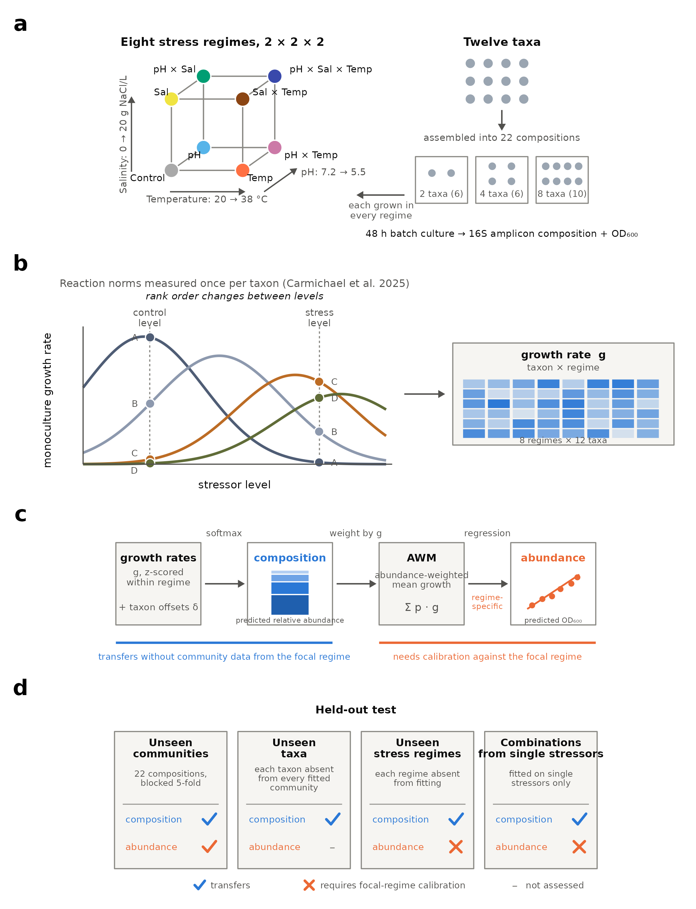

\newpage

## Abstract {.unnumbered}

Forecasting how communities reassemble under several simultaneous environmental stressors is a central challenge in ecology. However, whether community composition can be predicted from traits measured on species grown alone, and which parts of such a prediction carry over to new species and environments, remains unclear. Here we combine monoculture growth rates of twelve bacterial taxa with a Bayesian composition model and test its predictions in 22 defined community compositions, assembled at three richness levels under eight factorial combinations of temperature, pH and salinity stress. We show that community composition can be predicted from a single measured response trait, stress-matched growth rate, and that this prediction transfers to unseen communities, to the rank order of taxa absent from every fitted community, to stress regimes lacking community data and to stressor combinations calibrated only on single stressors. Growth rate is the only quantity measured per taxon; the taxon offsets are estimated from community data, and prediction needs both. Absolute community abundance, unlike composition, is predicted accurately only in the regimes used for calibration, because the relationship between community growth and abundance is itself regime-specific. Taken together, our findings indicate that trait-based forecasts of community composition can transfer across taxa and environments, whereas forecasts of abundance require community data from the focal environment.

\newpage

## Introduction

Organisms across ecosystems are increasingly exposed to several environmental stressors at once, including warming, acidification and salinisation [@Kefford2023; @Ct2016; @Schfer2018], and the combined effects of these stressors frequently deviate from additive expectations [@Ct2016; @Burgess2021]. Microbial communities, which underpin primary production, decomposition and nutrient cycling across soils, freshwaters and engineered systems [@Cydzik-Kwiatkowska2016; @Newton2011; @Schimel2012; @Cavicchioli2019; @Falkowski2008], are exposed in the same way. Forecasting how such communities reassemble under combined stressors is therefore a practical need as well as a test of ecological understanding. A central goal of community ecology is to make such forecasts from measurable functional traits [@McGill2006; @Violle2007; @Enquist2015; @Kraft2015]: if taxa differ in their stress sensitivities, environmental filtering should systematically reshape community composition as stressors intensify [@Kraft2015], and community-level properties should follow from the traits of the members that come to dominate [@Enquist2015].

Trait-based approaches have transformed understanding of plant community dynamics [@Enquist2015; @Tilman2004], phytoplankton biogeography [@Follows2007; @Litchman2008] and soil carbon cycling [@Malik2020]. Trait-based theory emphasises that trade-offs among growth, stress tolerance and resource acquisition structure communities along environmental gradients [@Tilman2004; @Litchman2008], while coexistence theory specifies how fitness differences translate into realised abundance [@Chesson2000]. In microbial systems, simple assembly rules and beyond-pairwise interactions can enable bottom-up prediction of community structure from component-level measurements [@Friedman2017; @Goldford2018; @Meroz2021; @Ishizawa2024], community growth dynamics can be predicted from monoculture growth-curve data [@Ram2019], and a mechanistic consumer-resource model parameterised from monoculture growth has predicted phytoplankton community composition across resource conditions and species richness [@Zhang2025]. For stressors, a performance-curve perspective explains why stressor interactions vary among studies: small changes in stressor intensity move populations across non-linear performance curves, switching interactions from antagonistic to synergistic [@Jackson2016; @Simmons2021; @Carmichael2025]. Together these observations suggest a two-step route to prediction: characterise the reaction norms of a set of taxa once, for each stressor singly and in combination, as previously done for the twelve taxa used here [@Carmichael2025], and then test whether growth at the stressor levels a community actually experiences predicts its composition and abundance. The performance-curve perspective does not, by itself, deliver that second step.

However, three questions about that second step remain open. First, it is unclear whether a single stress-specific response trait can quantitatively predict multi-taxon assembly under factorial stressor combinations, because the bottom-up predictions above were developed largely by varying resources and species pools rather than abiotic stressors. Second, predictions are usually evaluated on the conditions used to calibrate them, so it remains unclear which parts of a trait-based prediction carry over to taxa, environments and stressor combinations absent from the fitted data. Third, community composition and community abundance are often treated as a single forecasting target, although they need not be governed by the same processes. Answering these questions requires a system in which stressors, starting composition and environmental history can be manipulated factorially, which natural systems rarely allow, because drivers covary, stressors fluctuate and composition feeds back on local conditions [@Philippot2021; @Choudoir2022; @Justice2017; @Pirotta2022]. Synthetic microbial communities, by which we mean defined communities assembled from known, culturable isolates, offer a model-system approach analogous to the use of *Drosophila* or *Arabidopsis* in other fields: they retain multi-taxon assembly and environmental filtering while allowing factorial manipulation [@Pascual-Garca2025; @Connors2023; @Dolinek2016; @Grokopf2014; @Bengtsson-Palme2020], and so provide empirical benchmarks for when simple trait-based predictions succeed and when they should fail [@Grimm2012; @Liang2022].

Here we test whether monoculture growth rates predict the composition and abundance of synthetic bacterial communities across all combinations of temperature, pH and salinity stress, and map which parts of that prediction transfer (@fig-1). We assembled 22 community compositions from a pool of twelve taxa at three richness levels (two, four and eight taxa) and grew each under the eight regimes of a fully factorial 2 × 2 × 2 design (20 vs 38 °C; pH 7.2 vs 5.5; 0 vs 20 g NaCl L$^{-1}$). Stressor levels were placed on published performance curves, one near-optimal control level and one post-optimum stress level per stressor, in the region where taxon rankings reshuffle across regimes, which is the demanding case for trait-based prediction [@Carmichael2025]. Taxon growth rates for each regime were obtained from those monoculture performance curves. Endpoint composition was measured by 16S rRNA gene amplicon sequencing and community abundance as optical density after 48 h, approximately 5--10 generations of growth and resource-limited competition. A Bayesian model mapped stress-specific growth rates to relative abundances, and predicted compositions were carried forward to community abundance through abundance-weighted mean growth. We then tested transfer to unseen communities, to taxa absent from every fitted community, to stress regimes with no community training data and to stressor combinations calibrated only on single stressors.

We expected composition and abundance to transfer differently. Under substitutive inoculation into a shared batch environment, relative abundance at the endpoint should track relative growth differences among co-occurring taxa, because small differences in growth rate compound over successive generations and fitness differences determine which taxa come to dominate [@Chesson2000; @Kraft2015]. Composition is a relative quantity, so the mapping from within-regime growth differences to relative abundance need not change among regimes, and should transfer to regimes and taxa whose growth rates are known. Community abundance, by contrast, is an absolute quantity, set by how much of the shared resource is converted into cells. It depends on yield as well as on growth rate, and growth and yield are distinct axes of microbial strategy that need not covary [@Litchman2008; @Malik2020]. We therefore expected abundance to track abundance-weighted growth within a regime [@Enquist2015] but to depend additionally on regime-specific yield, so that abundance forecasts would require calibration against community data from the focal regime.

<!--
FIGURE 1 DRAWING SPECIFICATION (drawn by scripts/16_fig1_schematic.R; no data in this figure).
Four panels, left to right or 2 x 2, flat vector style, same stress colours as Figs 2 and 4.
(a) Design. A 2 x 2 x 2 cube whose axes are temperature (20 vs 38 C), pH (7.2 vs 5.5)
    and salinity (0 vs 20 g NaCl/L); eight labelled corners (Control, pH, Sal, Temp,
    pHSal, pHTemp, SalTemp, pHSalTemp). Beside it, a pool of twelve taxa (coloured dots)
    drawn into communities of two, four and eight taxa (6, 6 and 10 compositions; 22 total),
    each assembled in every regime; 48 h batch culture; endpoint 16S amplicon composition
    and OD600.
(b) Step 1, measured once. Monoculture reaction norms: growth rate against stressor level
    for a few taxa, crossing curves, with vertical lines at the control and stress levels
    showing that rank order changes between levels. Output: a taxon x regime table of
    growth rates g.
(c) Step 2, prediction. Growth rates g (z-scored within regime) -> softmax with taxon
    offsets delta_j -> predicted relative abundances (stacked bar) -> abundance-weighted
    mean growth (AWM) -> regime-specific regression -> predicted OD600.
(d) Transfer map. Four held-out tests as tiles: unseen communities, taxa absent from every
    fitted community, unseen stress regimes, combinations from single stressors. Each tile
    shows a composition tick (transfers) and, for regimes and combinations, an abundance
    cross (requires focal-regime calibration).
-->

::: {#fig-1 fig-pos="htbp"}

{width=100%}

**A two-step design links monoculture reaction norms to community prediction and maps what transfers.** Experimental design (**a**): twelve bacterial taxa were assembled into 22 community compositions at three richness levels (*n* = 6 two-taxon, 6 four-taxon and 10 eight-taxon compositions), and each composition was grown for 48 h under all eight regimes of a 2 × 2 × 2 factorial design of temperature (20 vs 38 °C), pH (7.2 vs 5.5) and salinity (0 vs 20 g NaCl L$^{-1}$) (**Table 1**); endpoint composition was measured by 16S rRNA gene amplicon sequencing and abundance as OD$_{600}$. Step 1 (**b**): monoculture reaction norms, characterised once, supply a stress-specific growth rate for each taxon and regime; rank order among taxa changes between control and stress levels. Step 2 (**c**): within-regime growth rates are mapped to predicted relative abundances by a softmax with taxon offsets, and predicted compositions are converted to abundance-weighted mean growth (AWM) and then to predicted OD$_{600}$ through a regime-specific regression. Transfer tests (**d**): prediction was evaluated on communities, taxa, stress regimes and stressor combinations withheld from fitting.
:::

## Results

### Stressors reshape diversity and composition along distinct axes

We first assessed the impacts of temperature, pH and salinity, and their combinations, on the compositional structure of the eight-taxon communities (**Table 1**). Shannon diversity (H′) was similar in the control, pH and salinity treatments, but declined across all temperature-involving regimes (one-way ANOVA: F₍~7,72~₎ = 26.84, P < 10$^{-17}$; @fig-2). The lowest H′ occurred under the pH × temperature regime, with intermediate values under salinity × temperature and the three-stressor regime. Tukey post hoc contrasts confirmed that each temperature-involving treatment had lower H′ than the control, whereas control vs pH and control vs salinity were not significant after adjustment (full pairwise tests, effect sizes and 95% CIs in **Table S5**).

Distance-based redundancy analysis (db-RDA) revealed a dominant gradient along RDA1 that explained 80.9% of the constrained variance, separating temperature-involving communities toward positive RDA1 from salinity-influenced communities toward negative RDA1, with control and pH clustering intermediately and overlapping broadly (@fig-2). Community composition differed among treatments (PERMANOVA R² = 0.43, P = 0.001). The strongest pairwise separation was salinity vs temperature (R² = 0.55, adjusted P = 0.028), while comparisons among temperature-involving regimes were not significant after correction (adjusted P > 0.28), indicating partial compositional overlap within the temperature cluster (full pairwise matrix in **Table S6**). Indicator-taxon analysis identified distinct associations with stress regimes (@fig-2). *Janthinobacterium* sp. characterised the control (IndVal.g = 0.89), *Aeromonas* sp. the salinity treatment (0.89) and *Microbacterium* sp. the elevated-temperature treatments (0.81). *Pseudomonas fluorescens* was most strongly identified as an indicator under salinity × temperature, with a weaker association under pH × temperature and none under temperature alone (**Table S7**).

![**Temperature reduces diversity, whereas salinity drives compositional divergence.** Shannon diversity (H$'$) of eight-taxon communities under control conditions, single stressors (pH 5.5, salinity 20 g NaCl L$^{-1}$, temperature 38 °C), and all pairwise and three-stressor combinations after 48 h (**a**); boxes show medians and interquartile ranges, whiskers denote 1.5 $\times$ IQR, and points represent individual communities (*n* = 10 per treatment). Distance-based redundancy analysis (db-RDA) of Bray--Curtis relative-abundance profiles (**b**); ellipses denote 95% confidence intervals around treatment centroids, and axis labels give constrained variance explained (RDA1 = 80.9%, RDA2 = 12.7%). Pairwise PERMANOVA effect sizes (R$^2$) among treatments (**c**); asterisks indicate significant pairwise differences (PERMANOVA, FDR-corrected *P* < 0.05). Indicator-taxon analysis (**d**); point shading gives indicator values (IndVal.g), and only the top-associated taxon per treatment is shown.](../results/figures/Fig_1.png){#fig-2 fig-pos="htbp"}

### Growth-rate rankings reverse across stressor regimes

We next asked whether these shifts could be explained by a single taxon-level response trait, growth rate, measured in monoculture under the same eight regimes (**Table 1**). To compare taxa within each regime, we standardised growth rates to within-regime z-scores, so that positive scores indicate above-average performance under that regime (@fig-3). Rankings were regime-specific: different taxa performed best under different stressors, with some overlap among temperature-involving treatments. Elevated temperature most favoured *Chromobacterium* sp. and *Chryseobacterium* sp., with *Microbacterium* sp. also above average; salinity most favoured *Serratia* sp., with *Erwinia* sp. and *Aeromonas* sp. close behind; and acidic pH favoured *Chromobacterium* sp. and *Pseudomonas fluorescens*. These patterns overlapped with, but did not mirror, the indicator-taxon analysis: *Aeromonas* sp. was both above average in growth and the indicator taxon under salinity, whereas the indicator under elevated temperature (*Microbacterium* sp.) was only the third-fastest grower. This imperfect correspondence between fastest grower and community indicator anticipates a result below: relative growth differences shape composition through graded shifts in abundance rather than complete dominance by the fastest taxon (z-score summary in **Table S8**; raw growth rates in **Table S24**).

![**Taxon growth-rate rankings reverse across stressor regimes.** Replicate monoculture growth rates of the twelve taxa were z-scored within each stress regime (grey points; *n* = 3 biological replicates per taxon and regime), and taxon means $\pm$ SE are shown as coloured circles, with colour encoding deviation from the regime mean (z-score). Dispersion was similar across regimes (SD $\approx$ 0.89--1.03); the total span was largest for pH $\times$ salinity (range $\approx$ 3.82) and also wide for temperature ($\approx$ 3.52). *Chromobacterium* sp. scored highest under elevated temperature and acidic pH and *Serratia* sp. under salinity, and the indicator taxa from the composition analysis (*Microbacterium* sp. under temperature, *Aeromonas* sp. under salinity; @fig-2) also scored above average under their respective regimes.](../results/figures/Fig_2_DOTPLOT_z_by_stress_compact.png){#fig-3 fig-pos="htbp"}

### Monoculture growth rates predict community composition

We asked whether monoculture growth rates measured under the matched regime predict the relative abundances of taxa in mixed communities. For each community the model received only the set of inoculated taxa, the stress regime and the taxa's stress-specific growth rates, standardised within regime; a softmax link converted growth into relative abundances, and taxon-specific offsets absorbed systematic deviations from growth (@sec-bayes). Predicted relative abundances explained 44% of the abundance-weighted variance in observed composition across all regimes and richness levels (weighted R² = 0.44; weighted RMSE = 0.22; [@fig-4]a). This performance held for communities withheld from fitting. In blocked five-fold cross-validation that held out entire community identities, held-out composition error was low and stable (mean RMSE = 0.131 $\pm$ 0.040 SD; mean Jensen--Shannon divergence = 0.089 $\pm$ 0.011 SD across folds) and broadly similar across stress regimes (**Tables S15, S16, S18**; **Fig. S6**).

Composition prediction depended on the model's graded structure. A crude rule that assigns each community wholly to its fastest-growing member failed for composition (weighted R² = −0.93, against 0.44 for the model; [@fig-4]d; **Table S25**), even though the presumptive winner was the observed dominant taxon in 67% of communities. Ablating the model under the same blocked cross-validation showed that neither of its two components predicts held-out communities alone (**Table S26**). Removing growth rates, so that prediction rested on fitted taxon offsets, collapsed out-of-fold accuracy (weighted R² = −0.29; dominant taxon correctly identified in 62% of communities); removing the offsets did likewise (weighted R² = −0.07; 67%); only the full model predicted (weighted R² = 0.39; 80%). The two components are not equivalent, however. Growth rate is the only measured input, whereas the offsets are fitted parameters, and taxa absent from every fitted community, whose offsets fall back to their prior, were still predicted in rank order (next section). Growth rate was also the most informative monoculture growth parameter: substituting lag time or carrying capacity in the same pipeline reduced composition accuracy to weighted R² = 0.08 and 0.11 respectively (**Table S22**).

<!-- AUTHOR DECISION: the sentence below was rewritten to state only what the
     Methods document. If the OD600 = 0.05 inoculum was in fact chosen to keep
     early readings measurable and replicable, the stronger version is:
     "Monocultures were inoculated at a deliberately high starting density
     (OD600 = 0.05), chosen so that early optical density readings are
     measurable and replicable, and as a consequence the time series offer only
     a short, sparsely sampled exponential window for log-linear estimation,
     whereas the Gompertz fit uses the whole trajectory."
     Only restore this if that was the actual design rationale. -->

Composition accuracy depended on how growth rate was estimated. The growth rates used throughout are Gompertz estimates fitted to the whole monoculture trajectory (@sec-trait). A model-free log-linear estimate, the steepest slope of log$_{10}$(OD$_{600}$) over rolling windows, correlated strongly with the Gompertz estimates (Pearson r = 0.95; Spearman ρ = 0.94 overall and 0.78--0.97 within regimes; **Table S23**; **Fig. S9**). Nevertheless, rerunning the pipeline with log-linear estimates reduced composition accuracy from weighted R² = 0.437 to 0.299, roughly a third of the composition signal, while leaving abundance prediction unchanged (R² = 0.882 versus 0.893; **Table S22**). We retain the Gompertz estimate because it is the better-identified estimator for these assays. Monocultures were inoculated at OD$_{600}$ = 0.05 and sampled every 2 h for the first 12 h and approximately every 4 h thereafter, with all taxa reaching stationary phase within approximately 24 h ([@sec-trait; @sec-microcosm]), so the exponential phase is covered by few time points and the log-linear window is correspondingly short and sparsely sampled, whereas the Gompertz fit uses the whole trajectory. The asymmetry between the two responses is itself informative. A composition prediction carried by taxon identity or by the stress and richness terms would be indifferent to how growth rate was estimated. That composition accuracy degrades when the trait is estimated more crudely, while abundance prediction does not, is what we expect if composition is driven by the trait and abundance is carried largely by the dominant members (see below).

![**Monoculture growth rates predict community composition, and community abundance follows from the dominant members.** Observed versus posterior mean predicted relative abundance of each taxon in each community across all stress regimes and richness levels (**a**; *n* = 172 community samples); horizontal bars are 90% credible intervals, colour denotes stress regime and shape denotes richness, and the dashed line is 1:1 (weighted R$^2$ = 0.44; weighted RMSE = 0.22). Observed versus predicted community abundance (OD$_{600}$ at 48 h) from abundance-weighted mean growth (AWM) (**b**; *n* = 171 communities; RMSE = 0.10, R$^2$ = 0.88); the model conditions on predefined community membership (2, 4 or 8 taxa). Decomposition of the abundance fit (**c**): R$^2$ of the abundance regression with stress and richness terms only, and with growth rates weighted by equal shares, by a winner-takes-all rule, by the observed composition (oracle) and by the model's predicted composition (**Tables S11, S19, S25**). Winner-takes-all rule versus model for composition (weighted R$^2$) and abundance (R$^2$) (**d**; **Tables S22, S25**); the dashed line marks R$^2$ = 0, below which predictions are less accurate than the mean.](../results/figures/Fig_4.png){#fig-4 fig-pos="htbp"}

### Composition prediction transfers to unseen taxa, regimes and stressor combinations

We next asked whether the growth-to-composition mapping transfers beyond the data used to fit it, in three tests of increasing stringency (@fig-5).

First, we held out each stress regime in turn, so that the model had no community data from the regime it predicted and its stress-specific slope and concentration reverted to their hierarchical means (@sec-bayes). Composition prediction for these unseen regimes was essentially as accurate as for unseen communities (mean RMSE = 0.136 $\pm$ 0.009 SD; mean JS = 0.093 $\pm$ 0.020 SD across the eight held-out regimes, compared with RMSE = 0.131 $\pm$ 0.040 for blocked community-identity cross-validation; [@fig-5]a; **Tables S18, S20**). Monoculture growth rates for the held-out regime remain part of the input; what transfers is the mapping from within-regime growth differences to relative abundance.

Second, we fitted the model on the control and single-stressor regimes only and predicted the four combined-stressor regimes. Composition error for the combinations was close to that for unseen communities (RMSE = 0.140, versus 0.131), and the dominant taxon was correctly identified in 81% of combined-stressor communities ([@fig-5]a; **Table S28**). Extreme dominance was captured less well (pooled weighted R² = 0.17), so what transfers most robustly from single to combined stressors is the identity and ordering of taxa rather than the magnitude of dominance.

Third, we refitted the model without any community containing a focal taxon, so that the taxon's offset was informed only by its shrinkage prior, and predicted that taxon in the held-out communities (**Table S27**). This is a test of rank ordering. For all twelve taxa, the predicted relative abundance of the never-fitted taxon was positively rank-correlated with its observed relative abundance (Spearman ρ = 0.51--0.89; pooled ρ = 0.72; [@fig-5]c). Absolute accuracy was lower than for calibrated taxa: prediction error for the held-out taxon exceeded that for the calibrated taxa in the same communities (pooled RMSE = 0.221, against 0.110--0.155 for calibrated taxa across the twelve tests; [@fig-5]d), and held-out taxa were over-predicted on average (pooled bias = +0.085). Both are the expected behaviour of an offset that falls back to its prior rather than a defect of the model: without calibration, a taxon's systematic deviation from its growth-based expectation cannot be estimated, so its predicted share is set by its growth rate alone, without the taxon-specific adjustment that calibrated taxa receive. Growth rate alone therefore recovers where a never-fitted taxon ranks within a community, but not its exact share.

### Absolute abundance requires calibration data from the focal regime

Carried forward through the abundance-weighted mean growth (AWM) of each community, predicted compositions predicted endpoint OD$_{600}$ closely within the calibrated regimes (R² = 0.88; RMSE = 0.10; [@fig-4]b). This fit should be read against what the abundance model achieves without any trait. The model contains stress and richness terms, and these alone explained half the variance (R² = 0.50); adding AWM as a single additional parameter raised this to 0.84, and allowing stress-specific AWM slopes raised it to 0.88 ([@fig-4]c; **Table S19**). The trait term is strongly supported (partial R² over the null: 0.69 for the additive term, 0.76 for the full set of trait terms; joint test of the trait terms, F(8,153) = 62.2, *P* < 10$^{-43}$; AWM coefficient t = 18.8; **Table S19**), but half of the in-sample abundance fit is carried by regime and richness effects.

Within a regime, abundance is carried by the dominant, fastest-growing members. Benchmarks that share the same abundance regression but supply it with different compositions make this explicit ([@fig-4]c; **Table S11**). Weighting growth rates by equal shares, which discards all composition information, already reached R² = 0.766. Supplying the observed composition, the best possible case if composition were known exactly, reached 0.865, so the total gain available from composition information is roughly 0.10 in R². The model's predicted compositions captured essentially all of it (R² = 0.88; ΔRMSE = −0.01 OD$_{600}$ relative to the observed-composition benchmark), whereas random compositions performed poorly (R² = 0.51). Assigning each community wholly to its fastest grower also reached R² = 0.865 for abundance, matching the observed-composition benchmark, while failing completely for composition (weighted R² = −0.93; [@fig-4]d; **Table S25**). A rule that is wrong about composition can be right about abundance because abundance within a regime depends mainly on which taxa dominate, and the fastest grower is usually among them. The model therefore extracts nearly all the composition-attributable signal in abundance, and that share is modest because dominance carries the rest.

The abundance mapping held for withheld communities whose regime was represented in the calibration data (blocked cross-validation: mean R² = 0.783 $\pm$ 0.172 SD and mean RMSE = 0.117 $\pm$ 0.036 SD across folds; **Fig. S7**; **Tables S15, S18**), the weakest fold (R² = 0.49) being the one with the narrowest OD range and highest minimum abundance (**Table S17**). It did not extrapolate to regimes absent from calibration. With each regime held out in turn, and no stress terms estimable for it, held-out abundance prediction failed (mean R² = −3.4 $\pm$ 3.5 SD, negative for six of eight held-out regimes; mean RMSE = 0.293 $\pm$ 0.101; [@fig-5]b; **Tables S20, S21**; **Fig. S8**). Abundance in combined-stressor regimes predicted from single-stressor calibration fared no better (R² = −0.51; [@fig-5]b; **Table S28**). A negative R² means that the predictions were less accurate than the mean of the held-out observations. The same analyses in which composition transferred with little loss of accuracy therefore show that the mapping from abundance-weighted growth to abundance is regime-specific and must be estimated from community data for the focal environment ([@fig-5]a,b).

![**Composition prediction transfers to unseen communities, regimes, stressor combinations and taxa, whereas absolute abundance does not.** Held-out composition error (RMSE of relative abundances) for unseen communities (blocked community-identity cross-validation, one point per stress regime, *n* = 8; **Table S16**), unseen stress regimes (leave-one-stress-out, one point per held-out regime, *n* = 8; **Table S20**) and combined-stressor regimes predicted from control and single-stressor calibration (one point per combination regime, *n* = 4; **Table S28**) (**a**); horizontal bars are means. Held-out abundance R$^2$ for the same tests (**b**): one point per cross-validation fold (*n* = 5; **Table S15**), one point per held-out regime (*n* = 8; **Table S20**) and the pooled value for the four combination regimes (diamond, *n* = 84 communities; **Table S28**); the dashed line marks R$^2$ = 0, below which predictions are less accurate than the mean, and the dotted line the in-sample R$^2$ (0.882); per-regime observed-versus-predicted plots are in **Fig. S8**. Leave-one-taxon-out rank agreement (**c**): Spearman correlation between predicted and observed relative abundance of each taxon when every community containing it was excluded from fitting (*n* = 70--104 held-out community samples per taxon); the dotted line is the pooled value (0.72). Prediction error in the same tests (**d**) for the held-out taxon (circles) and for the calibrated taxa in the same communities (squares) (**Table S27**).](../results/figures/Fig_5.png){#fig-5 fig-pos="htbp"}

## Discussion

Monoculture growth rates measured under matched stressor regimes predicted how synthetic bacterial communities reassembled across all combinations of temperature, pH and salinity stress, and this prediction transferred. Composition was predicted for communities, stress regimes and stressor combinations absent from the fitted data with little loss of accuracy, and the rank order of taxa absent from every fitted community was recovered from their growth rates. Absolute community abundance, in contrast, was predicted accurately only within calibrated regimes. These results separate two forecasting targets that are often treated as one: composition, which followed relative growth differences and transferred, and abundance, which was carried by the dominant members through a regime-specific mapping and did not transfer.

The predictions rested on distinct, stressor-specific filtering. Temperature was the dominant driver of alpha diversity: Shannon diversity declined only in temperature-involving treatments, consistent with warming amplifying fitness differences along thermal performance curves and narrowing the realised niche space of thermally sensitive taxa (@fig-2). pH and salinity applied singly maintained diversity near control levels while reshaping composition. Temperature and salinity acted as largely orthogonal filters, imposing distinct physiological constraints (protein stability and membrane homeostasis under warming; osmotic balance under salinity [@Gregory2021; @Petrosyan2024; @Renne2023; @Terradot2024]) whose net effects are integrated by growth rate. Crucially, taxon rankings reversed across regimes (@fig-3). This reshuffling is the prerequisite for growth-based prediction: were rank order invariant, the same taxa would dominate everywhere, and stressors would impose uniform suppression rather than reassembly.

In closed batch microcosms with substitutive inoculation, taxa that divide faster under a given regime gain share during the shared growth phase, and small initial differences in growth rate compound into large differences in relative abundance over the approximately 5--10 generations to the endpoint. This explains why a relative quantity, composition, followed relative growth differences, and why the within-regime mapping from growth to composition carried over to regimes and stressor combinations not used for fitting, as we expected a priori. The model's success does not imply that biotic interactions are absent. It indicates that in well-mixed batch culture, where abiotic filtering is strong, the component of assembly driven by stress-dependent growth differences is large enough to be predictive and general enough to transfer.

Abundance behaved differently, and the baseline comparisons show why. Within a regime, abundance was carried by the dominant, fastest-growing members: a rule that assigns each community to its fastest grower matched the observed-composition benchmark for abundance while failing completely for composition, and knowing composition exactly added only about 0.10 in R² over a composition-blind average of member growth rates. Our model captured nearly all of that increment, operationalising a community-weighted mean trait approach [@Enquist2015] under factorial multi-stressor conditions, but the increment is modest because dominance carries the rest. Dominance also explains why abundance was predicted more accurately than composition in-sample: errors among rare taxa have little effect on the aggregate, and microbial abundance distributions are typically highly skewed [@Shoemaker2017]. The composition model does underpredict the most dominant taxa, because the shrinkage inherent in the Dirichlet--softmax formulation pulls extreme predictions towards the community mean, but this conservative bias has limited consequence for aggregate abundance. What abundance does not share with composition is its dependence on the regime itself. Endpoint abundance is bounded by carrying capacity, and a higher growth rate does not imply a higher yield, so the mapping from abundance-weighted growth to abundance shifted among regimes in ways the trait could not recover. Forecasting abundance in a new environment therefore requires community data from that environment, whereas forecasting composition requires only monoculture growth rates measured there.

Our results complement recent mechanistic prediction of community composition. Zhang and Becks [@Zhang2025] integrated a consumer-resource model with the monoculture growth of twelve phytoplankton species over a range of nitrate, ammonium or phosphorus concentrations, and accurately predicted the composition of 960 communities across species richness and resource conditions. Our study differs in three respects. First, the environmental axes are abiotic stressors rather than resource supply, so the trait integrates physiological tolerance rather than resource-dependent growth. Second, we map explicitly what transfers and what does not: composition carried over to unseen communities, regimes and stressor combinations and, in rank order, to taxa absent from every fitted community, whereas absolute abundance required regime-specific calibration. Third, our model uses a single measured trait per taxon and regime rather than a parameterised consumer-resource model, and so offers a parsimonious alternative where the resources and consumption parameters that such models require are unknown. Together with evidence that community structure follows simple assembly rules [@Friedman2017; @Goldford2018] and that community growth can be predicted from monoculture growth curves [@Ram2019], these results suggest that bottom-up prediction from traits measured in isolation is feasible along both resource and stressor gradients.

These findings have practical implications for engineered microbial systems, such as wastewater bioreactors, industrial fermentation and bioremediation, where stressor regimes are specified by design and monoculture growth assays for component taxa are routine [@Lindemann2016; @Lawson2019]. Because reaction norms need be characterised only once, from a modest number of levels per stressor [@Carmichael2025], community composition could be forecast at any regime on those curves before a consortium is assembled, providing a quantitative starting point for rational consortium design and complementing the broader set of engineering principles emerging for microbiome design [@Lawson2019]. Forecasts of total abundance at a new operating regime would additionally require a calibration experiment in that regime.

Our approach has limitations, each of which suggests a remedy. A limitation of our work is that absolute composition accuracy depends on how well growth rate is estimated: replacing the Gompertz estimate with a cruder log-linear estimate removed roughly a third of the composition signal. Improving this requires growth assays designed to resolve the exponential phase, for example with lower inocula and denser early sampling, which should improve composition prediction and is a task for the future. Similarly, taxa absent from every fitted community were ranked correctly but over-predicted on average, with higher error than calibrated taxa, because their offsets could not be estimated. Including each taxon in a small number of calibration communities, or measuring the sources of its systematic deviation, such as 16S rRNA gene copy number, would reduce this bias. The requirement for regime-specific calibration of abundance is a third limitation. It could be relaxed if regime-specific yield could be predicted from monoculture measurements, although carrying capacity alone was a poor substitute for growth rate in our pipeline (**Table S22**), so this requires dedicated tests. Beyond these, several ecological processes can weaken the link between monoculture growth and community dominance. Cross-feeding and facilitation, interference competition (for example, toxins), priority effects, spatial structure and consumer control can all allow slower-growing taxa to persist or dominate despite lower intrinsic growth [@Kerr2002; @Fukami2015; @Connors2026; @Athreya2025; @Mehlferber2024]; adaptation may alter growth rankings under stress over longer timescales [@Lenski2017]; and in open systems with continual immigration or fluctuating environments, frequency dependence, transient dynamics and eco-evolutionary feedbacks could further weaken the trait--composition link [@RossGillespie2007; @Hairston2005]. Although we focused on well-mixed batch culture, our approach can be readily extended to chemostats and other systems approaching steady state, where resource competition and interaction networks can be quantified explicitly [@vandenBerg2022].

Taken together, our results support a route by which multiple stressors scale from taxon-level growth to community structure: stressors reshape growth-rate ranks, altered ranks shift relative abundances through environmental filtering, and the resulting compositions determine which members carry community abundance. This route transfers for composition and is regime-specific for abundance. It thereby provides quantitative benchmarks for when prediction from a single response trait should hold, and testable predictions for when it should fail: as biotic interactions strengthen, spatial structure develops, evolutionary change alters growth-rate rankings, or fluctuating environments favour bet-hedging over maximal growth. It remains to be determined how well these predictions scale up to larger species pools, open systems and longer timescales, and at what point additional traits, such as survival under stress, resource-use efficiency or interaction-mediated effects, become necessary. Understanding where growth-rate-based prediction breaks down will require ecological models that account for emergent properties arising from species interactions [@vandenBerg2022].

## Methods

### Bacterial taxa

We used twelve heterotrophic bacterial isolates originating from Icelandic geothermal pools and experimental mesocosms in Dorset, England [@Garca2018; @Schaum2017]. These source systems vary in pH, salinity, and temperature; accordingly, the isolates are expected to be adapted to different physicochemical conditions and exhibit diverse tolerance profiles [@Garca2018; @Schaum2017]. Taxa were identified by 16S rRNA gene sequencing (GenBank accession numbers PX560147--PX560158; **Table S1**). Strains were stored in 20% glycerol stocks at −70 °C and revived by aseptically scraping cells from the frozen glycerol stocks directly into growth medium.

### Multi-stressor response trait {#sec-trait}

We measured population growth rates for each taxon across all stressor combinations in monoculture to quantify taxon-level stress-responses. Stressor regimes were chosen following a previously published framework [@Carmichael2025], using an environmental performance-curve rationale that defines "stress" relative to each taxon's unimodal growth--environment relationship. We first characterised performance curves for each stressor and identified post-optimum declines. We then selected one near-optimal "control" level and one post-optimum "stress" level for each stressor: temperature (20 vs 38 °C), pH (7.2 vs 5.5), and salinity (0 vs 20 g NaCl L$^{-1}$). Monoculture growth-rate estimates for the eight factorial stressor regimes (2 × 2 × 2; **Table 1**) were then obtained by subsetting these performance-curve datasets to the selected levels, yielding taxon-specific growth rates matched to the stressor regimes used in the community assays (@sec-microcosm). The monoculture growth-rate inputs used here therefore derive from the performance-curve datasets published in Carmichael et al. [@Carmichael2025]; the community assembly experiment, the endpoint 16S sequencing of the assembled communities, and the Bayesian framework scaling taxon-level traits to community composition and abundance are all new to this study. This placement ensures "control" conditions (20 °C, pH 7.2, 0 g NaCl L$^{-1}$) lie within the near-optimal range of the performance curves, while "stress" levels (38 °C, pH 5.5, 20 g NaCl L$^{-1}$) represent reductions from the optimum for most taxa. Monocultures of each taxon were grown in R2A medium (Oxoid, UK; CM0906), with NaCl concentrations set according to the experimental treatment and pH adjusted using sterile 1 M HCl or NaOH as required, and incubated at the target temperature until reaching carrying capacity (typically within \~24 h; assays were run to 48 h to ensure plateau under all stress regimes). Monoculture inocula were prepared as described for the community assays (@sec-microcosm): stock cultures were revived from −70 °C freezer stocks, pre-cultured in LB medium at 20 °C for approximately 72 h in 48-well plates, transferred to R2A medium and acclimated for 24 h under their respective stressor combinations, then diluted to a common starting density of OD$_{600}$ = 0.05 at the start of the experiment.

Optical density at 600 nm (OD$_{600}$) was recorded every 2 h for the first 12 h and then every \~4 h until OD reached a stationary-phase plateau, using a Varioskan LUX multimode plate reader (Thermo Scientific) with pathlength correction enabled and medium blanks included. For each taxon × condition, growth rates were estimated from monoculture OD data by fitting a Gompertz model to log~10~ (OD$_{600}$) over time (t, in hours):

$$
\begin{aligned}
\log_{10}\!\bigl(OD_{600}(t)\bigr) = \log_{10}(n_{0}) \;+\; & \bigl[\log_{10}(n_{\max}) - \log_{10}(n_{0})\bigr] \\
& \times \exp\!\Biggl(-\exp\!\biggl(\frac{r \cdot e}{\log_{10}(n_{\max}) - \log_{10}(n_{0})}\,(\lambda - t) + 1\biggr)\Biggr)
\end{aligned}
$$ {#eq-1}
where ${\log}_{10}(n_{0})$ is the starting density, ${\log}_{10}(n_{\max})$ is the carrying capacity, $r$ is the exponential growth rate (h$^{-1}$), and $\lambda$ is the lag time (hours). Nonlinear least-squares regression was implemented in R using 'nls.multstart' [@Padfield2021], initiating 500 random start sets and retaining the converged Gompertz fit with the lowest AIC across starting values (that is, selecting the best-fitting solution for the same model form, not comparing different growth models). Three biological replicates were assayed per taxon under each environmental condition, and the resulting set of monoculture growth rates was retained and treated as the species' stress-response growth rates.

As a sensitivity check on growth-rate estimation, we additionally re-estimated growth rates for every monoculture time series with a model-free log-linear method, taking the steepest slope of log$_{10}$(OD$_{600}$) over rolling windows of consecutive time points within the exponential phase (window widths of 4--8 points), and compared these estimates with the Gompertz estimates used in the pipeline (**Table S23**; **Fig. S9**). To compare the predictive value of alternative monoculture growth parameters, we also refitted the full composition-to-abundance pipeline (@sec-bayes) substituting, in place of growth rate, the lag time ($\lambda$) or carrying capacity ($\log_{10} n_{\max}$) obtained from Gompertz fits to the same time series, standardised within stress regimes in the same way (**Table S22**).

### Multi-stressor microbial microcosm experiment {#sec-microcosm}

We used synthetic bacterial microcosms to run a fully factorial stressor experiment under controlled and repeatable conditions. Temperature, pH, and salinity were set to predefined levels and applied in combination, while medium composition, incubation duration, and initial inoculation density were standardised across treatments.

We manipulated both single and multiple stressor combinations and the starting taxonomic diversity of our microcosms to investigate impacts on compositional structure and community abundance. Communities were assembled at three richness levels: two, four, and eight taxa. For richness two and four, we generated six distinct community compositions per richness; for richness eight, we generated ten compositions. Species compositions were sampled without replacement from the 12-taxon pool using stratified randomisation within each richness level and plate, with edge wells filled with sterile medium to minimise positional effects (**Table S3**). The same set of community identities at each richness level was assayed under each stressor treatment. In total, 22 distinct community compositions (six two-taxon, six four-taxon and ten eight-taxon) were each assembled under all eight stressor regimes, with endpoint OD$_{600}$ and 16S amplicon composition as the response variables.

Stressor treatments followed a factorial design with high temperature (38 °C), low pH (5.5), and high salinity (20 g NaCl L$^{-1}$), plus their combinations (**Table 1**). Stock cultures were revived from −70 °C freezer stocks, grown in LB medium at 20 °C for approximately 72 h in 48-well plates, then transferred to R2A medium and acclimated for 24 h under the target stressor conditions. pH was adjusted using sterile 1 M HCl or NaOH as required. OD$_{600}$ was measured on the Varioskan LUX using blanks and pathlength correction. Cultures were diluted to a common starting density of OD$_{600}$ = 0.05 (about 1 × 10$^{6}$ cells mL$^{-1}$) in the corresponding medium.

**Table 1 | Stressor treatment levels.** The combinations of stressors applied in the experiment and the corresponding level of each; "control" levels are near-optimal and "stress" levels post-optimum on the published performance curves (@sec-trait).

| Stressors | Temperature (°C) | Salinity (g NaCl/L) | pH |
|:---|:---:|:---:|:---:|
| Control | 20 | 0 | 7.2 |
| pH | 20 | 0 | 5.5 |
| Salinity | 20 | 20 | 7.2 |
| Temperature | 38 | 0 | 7.2 |
| pH x Salinity | 20 | 20 | 5.5 |
| pH x Temperature | 38 | 0 | 5.5 |
| Salinity x Temperature | 38 | 20 | 7.2 |
| pH x Salinity x Temperature | 38 | 20 | 5.5 |

Communities were inoculated into 48-well plates at a total volume of 1.0 mL using a substitutive design (equal total volume, divided among taxa): at richness two, 500 µL per taxon; at richness four, 250 µL per taxon; at richness eight, 125 µL per taxon. Plates were incubated at the designated treatment temperature for 48 h. We chose this duration based on monoculture time-series assays, which showed that all twelve taxa reached stationary phase within approximately 24 h across stress regimes (Figs. S1–S3), and on preliminary community growth curves confirming that mixed communities followed a similar trajectory. The 48 h endpoint therefore captures stationary-phase abundance following exponential growth and subsequent resource limitation, encompassing approximately 5–10 generations of population turnover. Concretely, the monoculture growth rates under these regimes (**Table S24**) correspond to doubling times of roughly 2--8 h for taxa maintaining positive growth, i.e. approximately 6--14 potential doublings in 48 h at 20 °C and up to ~26 for the fastest-growing taxon at 38 °C, while the net increase in community abundance from inoculation (OD$_{600}$ = 0.05) to stationary phase corresponds to approximately 3--5 population doublings; the 5--10 generations quoted here reflects this range. This generational depth is comparable to that of multi-year grassland experiments [@Tilman2001; @Weisser2017] that provide foundational evidence linking community structure to ecosystem properties; generational turnover provides the relevant ecological timescale for community assembly. Community abundance was measured as OD$_{600}$. Throughout, we use "abundance" as the single term for this response, in monocultures and communities alike; OD$_{600}$ is a species-specific optical proxy for abundance, and because no body mass or weight was measured we avoid the terms "biomass" and "density" for our own measurements.

### DNA extraction and sequencing

Community DNA was extracted using the DNeasy UltraClean Microbial Kit (Qiagen, Netherlands) following the manufacturer's instructions and processed in small batches, including a negative control in every other batch. Extracted samples were stored at −20 °C and processed by Novogene Corporation. DNA was quantified with a Qubit 2.0 fluorometer (dsDNA BR kit, Invitrogen). The V4 to V5 region of the 16S rRNA gene was amplified with primers 515F (GTGCCAGCMGCCGCGGTAA) and 907R (CCGTCAATTCCTTTGAGTTT)[@Klindworth2013]. PCR reactions (15 µL) contained Phusion High-Fidelity Master Mix (NEB), 0.2 µM of each primer, and approximately 10 ng template DNA. Cycling conditions were: 98 °C for 1 min; 30 cycles of 98 °C for 10 s, 50 °C for 30 s, 72 °C for 30 s; and 72 °C for 5 min. Amplicons were visualised on 2% agarose gels, purified (Universal DNA Purification Kit, Tiangen), indexed, and sequencing libraries were prepared with the NEBNext Ultra II FS DNA PCR-free Library Prep Kit (New England Biolabs) with indexes added. Libraries were quality-checked by Qubit, real-time PCR, and Bioanalyzer (Agilent), pooled, and sequenced on Illumina platforms according to effective library concentration and required data yield (Novogene). The expected insert length for 515F to 907R is approximately 392 bp, providing sufficient overlap for paired-end merging.

### Bioinformatic analysis

Metabarcoding reads were processed with the DADA2 pipeline [@Callahan2016] in R (v4.3.1) [@Team2010]. Residual primers and adaptors were removed with cutadapt [@Martin2011]. Read quality was assessed with FastQC [@SimonAndrews2010] and summarised with MultiQC [@Ewels2016]. Based on quality profiles, reverse reads were truncated at position 241 and reads were filtered with a maximum expected error (maxEE) of 5. Amplicon sequence variants (ASVs) were inferred with DADA2 (including dereplication, error-model learning, denoising, merging, and chimera removal) to generate the ASV table. Taxonomy was assigned with the naïve Bayesian classifier [@Wang2007] against the SILVA database (v138.1) [@Quast2012]. ASVs with fewer than ten total reads were filtered, and counts were converted to relative abundance with phyloseq [@McMurdie2013]. For downstream phylogenetic analyses, ASVs were aligned with Clustal Omega [@Sievers2011] and a midpoint-rooted tree was constructed. In this defined 12-isolate system, we additionally mapped ASV sequences to isolate 16S reference sequences (PX560147--PX560158) using BLASTn to confirm that dominant ASVs corresponded to the inoculated taxa (**Table S4**). We used the open ASV workflow with SILVA taxonomy, rather than closed-reference mapping to the isolate sequences alone, so that contaminants or unexpected sequence variants would be detected rather than forced onto the inoculated taxa. Relative abundances were not corrected for 16S rRNA gene copy-number variation; because copy number is a stable property of each taxon, this detection bias is consistent across treatments, and systematic per-taxon over- or under-representation is absorbed by the taxon-specific bias term $\delta_{j}$ of the composition model (Eq. 2).

### Data analysis

All R analysis scripts are available at (https://github.com/GabYvonDurocher/scaling-multiple-stressors).

#### Community diversity and composition analysis

All analyses were performed in R v4.3.1. Endpoint community composition was measured by 16S rRNA amplicon sequencing (see above), so all diversity and evenness metrics below were computed from ASV relative abundances. ASV counts were converted to relative abundances and ASVs with mean relative abundance $\leq$ 0.5% were removed. Community composition was quantified using Bray--Curtis dissimilarities [@Bray1957]. Differences among stress treatments (Control; pH, Salinity, Temperature; pH×Salinity, pH×Temperature, Salinity×Temperature; pH×Salinity×Temperature) were visualised with distance-based redundancy analysis (db-RDA; 'vegan::capscale') and tested with PERMANOVA ('vegan::adonis2', 9,999 permutations) [@Legendre1999; @Anderson2001; @Oksanen2015]. To check the key PERMANOVA assumption of equal multivariate dispersion among groups, we used 'vegan::betadisper' to compute each sample's distance to its treatment centroid (i.e., the within-group spread in ordination space) and compared these mean distances among treatments; significance was evaluated with permutation tests via 'permutest' on the betadisper model. Pairwise treatment contrasts were obtained with pairwiseAdonis which runs PERMANOVA for every treatment pair on the same distance matrix; the resulting p-values were adjusted for multiple testing using the Benjamini--Hochberg false discovery rate procedure, and effect sizes (R² from each pairwise PERMANOVA) were displayed as a heat map [@MartinezArbizu2020]. Alpha diversity was quantified as Shannon's H′ ('vegan::diversity'). Treatment differences were assessed by permutation ANOVA with Tukey-style post hoc contrasts computed from estimated marginal means ('emmeans') and significance bars relative to the Control [@Lenth2023]. Stress-specific indicator taxa were identified using one-vs-rest indicator species analysis with 'indicspecies::multipatt' and the IndVal.g index, a group-equalised indicator value that combines specificity (how restricted a taxon is to the target group) and fidelity (how consistently it occurs within that group) into a 0–1 score, maximised when a taxon occurs in all samples of, and only in, the focal treatment. Multiple testing was controlled by Benjamini--Hochberg adjustment and significant indicators were reported [@Dufrne1997; @DeCaceres2010; @Petzoldt2019].

#### Bayesian modelling of community composition and abundance {#sec-bayes}

We used a Bayesian statistical model to ask a simple question: given each taxon's growth rate under a particular stress regime, can we predict what the community will look like and how large its total abundance will be? The model takes monoculture growth rates as input, predicts each taxon's relative abundance in a mixed community, and then translates those predicted compositions into community-level abundance, propagating uncertainty at each step.

Community composition was modelled using relative abundances. Relative abundances are proportions: they are always non-negative and they always add up to one. To ensure our predictions obey these rules automatically, we used a multinomial-logistic (softmax) link function. The softmax takes one score per taxon and turns the whole set into proportions that sum to one. This means no matter what values the model assigns to taxa, the resulting predictions are always valid compositions.

Each taxon's score was built from its growth trait and some additional effects. Specifically, for sample *n* and taxon *j*, the score was
$$\eta_{nj} = \kappa_{s_{n},r_{n}}\, g_{nj}^{z} + \delta_{j}$$ {#eq-2}

Here, $g_{nj}^{z}$ is the growth rate of taxon *j* in sample *n*, standardised (z-scored) within the corresponding stress treatment by subtracting the stress-specific mean and dividing by the stress-specific standard deviation. This made growth values comparable across each stress regime and also stabilised model fitting. The coefficient $\kappa_{s_{n},r_{n}}$ is a slope that links growth to abundance and is allowed to vary with stress (pH, salinity, temperature) and richness. The main analysis reports these stress-specific slopes. The final term, $\delta_{j}$, is a taxon-specific bias. This bias captures systematic deviations that cannot be explained by growth alone, for example, taxa that are consistently under- or over-represented compared to their growth. Because the softmax is unchanged if the same constant is added to all taxa, we fixed one bias to zero so that the others are interpretable relative to it.

Once the scores were defined, the expected composition for sample *n* was given by
$$p_{n} = \text{softmax}\left( \eta_{n} \right),$$ {#eq-3}

which guarantees $\sum_{j = 1}^{J_{n}}p_{nj} = 1$ for any community size (2, 4, or 8).

Observed data were proportions (relative abundances), so we used a Dirichlet distribution as the likelihood. The Dirichlet is the natural probability distribution for compositional vectors: it only produces non-negative values and it forces the components to sum to one. We wrote this as
$$p_{n}^{\text{obs}} \sim \text{Dirichlet}\left( \phi_{s_{n}}\, p_{n} \right)$$ {#eq-4}

Where $\phi_{s} > 0$ is a stress-specific concentration parameter. This parameter controls how tightly the observed compositions cluster around the predicted composition. A large $\phi_{s}$ means low variability (observations hug the prediction), while a small $\phi_{s}$ allows more scatter. To avoid numerical problems from exact zeros in observed data, we added a vanishingly small jitter (machine precision) to zero entries and renormalised to sum to one. This stabilises computation but has no practical effect on results.

Before fitting, the data were prepared to reflect the experimental design. Each community had a predefined membership of two, four, or eight taxa. If a taxon was inoculated into the starting community but not detected at the end of the experiment, we inserted a zero and renormalised so the community still summed to one. This ensured that absence was treated as true absence, not as missing data. Stress treatments and richness levels were harmonised across data tables, and growth rates were merged in. For the composition model we used the stress-standardised values $g^{z}$, but we retained the raw growth rates $g^{raw}$(in physical units) for the abundance mapping step described below**.** For each taxon under each stress, replicate growth rates were averaged, and only samples with complete growth values for all inoculated community members were retained.

To stabilise estimation and avoid overfitting, we used hierarchical priors. The slopes $\kappa_{s,r}$ had a normal prior centred at zero with a shared variance term, shrinking them toward zero unless supported by the data. The biases $\delta_{j}$ had a similar shrinkage prior with the identifiability constraint already mentioned. The log of the concentration parameter $\phi_{s}$ was given a normal prior, which ensures positivity on the original scale. These priors allow information sharing across stresses and taxa while preventing extreme estimates in poorly informed cases.

Model fitting was done with Hamiltonian Monte Carlo (HMC) in Stan. We ran four chains and assessed convergence by requiring all parameters to have $\widehat{R} \leq 1.01$, adequate effective sample sizes, and no divergent transitions after warm-up. Full details of the HMC implementation, including chain length, warm-up, adapt_delta, tree depth, seed caching, and convergence diagnostics, are provided in Supplementary Methods S1.

Predictive performance was assessed in several ways. Per-sample log-likelihood contributions were recorded and used with Pareto-smoothed leave-one-out cross-validation (LOO) to check how well the model predicted held-out data. We examined the Pareto *k* diagnostics to ensure the approximation was reliable. To measure how close predictions were to observations, we compared posterior mean compositions to the observed proportions using root-mean-square error (RMSE) and Jensen--Shannon divergence (JSD). These metrics were reported for each stress regime and globally. For global summaries we weighted by observed abundance so that rare taxa did not dominate the evaluation. As a posterior predictive check, for a random subset of samples we generated new compositions from a Dirichlet distribution centred at the predictions and compared them to the observed using JSD.

To carry uncertainty forward into predicting community abundance, we transformed each posterior draw into an abundance-weighted mean growth (AWM) for each community *c* under stress *s*. For draw *d* this was
$$\text{AWM}_{\text{cs}}^{\text{d}} = \sum_{j}^{}p_{csj}^{d}\, g_{csj}^{\text{raw}}$$ {#eq-5}

Where $p_{csj}^{d}$ is the posterior abundance of taxon *j* and $g_{csj}^{raw}$ is its raw growth rate. This provides a distribution of community-level growth rates that reflect both uncertainty in composition and variability in single-taxon growth rates.

We then related community abundance, measured as OD$_{600}$, to AWM with a linear model that included stress and richness effects:

$$\text{OD}_{\text{cs}} = \beta_{0} + \beta_{1,s}\,{\bar{AWM}}_{cs} + \beta_{s} + \beta_{r} + \varepsilon,\quad\varepsilon \sim \mathcal{N}\left( 0,\sigma^{2} \right)$$ {#eq-6}

Here, $\beta_{0}$ is the intercept; $\beta_{1,s}$ is the slope linking AWM to ${OD}_{600}$, which was allowed to vary among stress regimes in the model as fitted (18 parameters in total); $\beta_{s}$ denotes stress effects (contrasts relative to a reference level); $\beta_{r}$ denotes richness effects; and $\varepsilon$ is residual error. We also report the additive specification with a single common slope $\beta_{1}$ (11 parameters), under which the conclusions are unchanged, and a fixed-effects-only null model containing the stress and richness terms but no AWM term (10 parameters), which quantifies the marginal contribution of the trait term (**Table S19**). Because endpoint ${OD}_{600}$ in batch culture reflects abundance after an initial exponential phase and subsequent stationary phase, we do not assume that community-mean growth mechanically determines abundance; instead, Eq. 6 estimates an empirical mapping from AWM to ${OD}_{600}$ while allowing stress and richness to shift expected abundance. Rather than fit Eq. 6 once to a single point estimate of AWM, we refit the OD--AWM regression across a subsample of posterior draws (400 draws): for each draw $d$, we computed $AWM^{d}$, refit Eq. 6, and pooled predictions across draws. This "multiple-imputation" approach propagates uncertainty from composition (and hence AWM) into the reported ${OD}_{600}$ prediction intervals.

To quantify strict out-of-sample performance of the full analysis pipeline (composition model → AWM → OD prediction), we performed blocked five-fold cross-validation in which entire community identities (Com_Id) were held out from model fitting. In each fold, the Dirichlet--softmax model was fit to the training communities only, posterior compositions were predicted for the held-out communities, and composition accuracy on the test set was summarised using RMSE and Jensen--Shannon divergence. We then propagated the predicted compositions to abundance-weighted mean growth (AWM) and fit the OD regression on the training set only; the fitted regression was used to predict OD for the held-out communities, and OD performance was summarised by test-set RMSE and R². Within each fold, stress-specific standardisation parameters (mean and SD) used to compute $g^{z}$ were estimated from the training data only and then applied to the held-out communities, to avoid information leakage across folds.

To test generalisation across environments rather than across communities, we additionally performed leave-one-stress-out (LOSO) cross-validation: each of the eight stress regimes was held out in turn, the composition model was fitted to the remaining seven regimes only, and compositions were predicted for the held-out regime. Because the held-out regime contributes no data to the fit, its stress-specific slope $\kappa_{s}$ and concentration $\phi_{s}$ are informed only by the hierarchical priors and shrink to the across-stress means, which is the appropriate prediction for an unseen environment. The OD regression in this analysis was fitted on the training regimes without stress terms (OD ~ AWM + richness), because stress-specific intercepts and slopes cannot be estimated for a regime absent from training; LOSO is therefore a strictly harder test than the blocked community-identity CV. Within-stress standardisation of growth rates uses only monoculture data, an exogenous input measured independently of the communities, so no community-level information leaks from the held-out regime.

To attribute the predictive signal within the composition model, we ablated it under the same blocked community-identity cross-validation: a growth-only variant (taxon bias terms $\delta_{j}$ removed), a biases-only variant (growth input set to zero, so prediction rests on taxon identity alone), and the full model. Held-out performance was summarised by pooled out-of-fold weighted R² and RMSE, mean per-sample RMSE and Jensen--Shannon divergence, dominant-taxon accuracy (the fraction of communities whose most abundant taxon is correctly identified), and the pooled held-out log predictive density (**Table S26**).

To test transfer to taxa never observed in any community, we performed leave-one-taxon-out validation: for each taxon in turn, the model was fitted only on communities not containing that taxon, so that its bias term is informed solely by its shrinkage prior, and the communities containing it were predicted (**Table S27**).

To test whether combined-stressor outcomes can be predicted from simpler environments, we fitted the composition model on the control and single-stressor regimes only and predicted the four combination regimes, whose stress-specific slopes shrink to the hierarchical mean exactly as in the LOSO analysis; the corresponding OD regression was fitted on the single-stressor regimes without stress terms (**Table S28**).

Performance was placed in context with three baselines. An 'oracle' benchmark used the observed compositions to compute AWM, which represents the best possible case if community composition were known exactly. An 'equal-abundance' baseline gave each planned member the same share, a naïve null model. A 'random' baseline drew compositions from a symmetric Dirichlet, representing stochastic assembly without growth information. Comparing against these baselines showed how much was gained by linking monoculture growth rates to community composition and carrying uncertainty forward into abundance predictions.

### Reporting summary

Further information on research design is available in the Nature Portfolio Reporting Summary linked to this article.

## Data availability {.unnumbered}

The 16S rRNA gene sequences of the twelve bacterial isolates are available in GenBank under accession numbers PX560147--PX560158 (**Table S1**). The processed amplicon sequence variant (ASV) count and taxonomy tables, sequencing metadata, community OD$_{600}$ data and monoculture growth data used in all analyses are available in the project repository (<https://github.com/GabYvonDurocher/scaling-multiple-stressors>). **[PLACEHOLDER: accession number and repository for the raw 16S rRNA gene amplicon reads (for example an NCBI SRA BioProject) to be added before submission.]**

## Code availability {.unnumbered}

All R analysis scripts and Stan model files are available at <https://github.com/GabYvonDurocher/scaling-multiple-stressors>. **[PLACEHOLDER: DOI of an archived release of the repository (for example Zenodo) to be added before submission.]**

## Acknowledgements {.unnumbered}

**[PLACEHOLDER: acknowledgements and funding, including grant numbers, to be supplied by the authors.]**

## Author contributions {.unnumbered}

Hebe Carmichael (HC) and Ilgaz Cakin (IC) contributed equally. HC: Investigation, Methodology, Data curation, Writing -- original draft. IC: Formal analysis, Software, Visualization, Writing -- original draft. Susheel Bhanu Busi (SBB): Investigation, Methodology, Resources. Daniel Read (DR): Resources, Supervision. Gabriel Yvon-Durocher (GYD): Conceptualization, Funding acquisition, Supervision, Writing -- review & editing.

## Competing interests {.unnumbered}

<!-- Derived from the authors' statement of 23 March 2026 (Ecology Letters
     submission: "All authors have approved the manuscript and declare no
     competing interests"). Reconfirm with all authors before submission. -->

The authors declare no competing interests.

## References

::: {#refs}
:::
